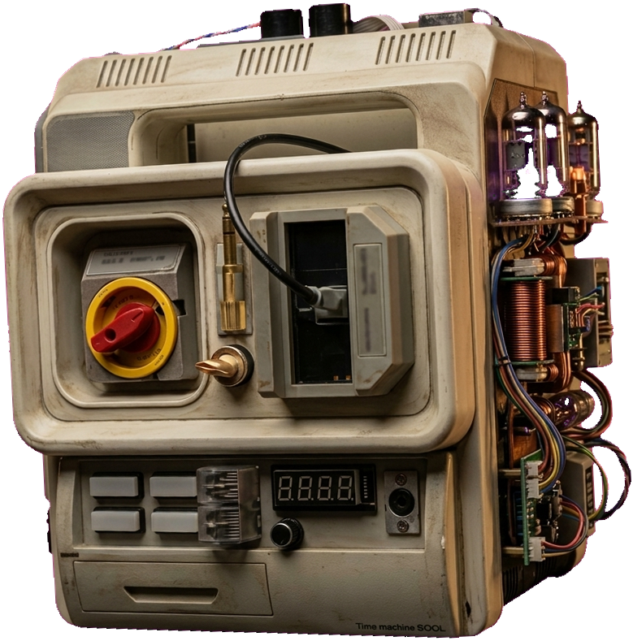

# Stuart Saves the Pomodoro (SSTP) 🍅⏱️

A retro-futuristic Pomodoro timer desktop application for Linux, built around the "Time machine SOOL" laboratory device from *Stuart Saves the Universe*.



---

## Features

- **Interactive Retro Hardware Interface**:
  - **Red Rotary Switch**: Click the circle around the main red rotary knob to **Start**, **Pause**, or **Restart** the timer.
  - **Lower-Left White Buttons**: Click any of the four rectangular illuminated buttons to open the **Settings & Statistics** console.
  - **Cartridge / Brass Jack Bay**: Click to manually toggle between **Work Mode** and **Break Mode**.
  - **Movable Desktop Companion**: Click and drag anywhere on the beige chassis to reposition the machine on your desktop.
- **Pixel-Perfect 7-Segment LED Overlay**:
  - Exact bright neon-red 7-segment digital time display (`MM:SS`) overlaid onto the hardware panel.
  - Authentic phosphor bloom, saturated glowing core, and blinking colon separator.
  - Displays over unlit segment geometry with zero misalignment.
- **Vacuum Tube Warmth**:
  - Dynamic breathing glow on the exposed mercury vapor vacuum tubes and heated filaments while the time machine is active.
- **Sound Engine**:
  - Ships with an authentic procedural digital clock ticking sound (`assets/sounds/tick.wav`).
  - Sci-fi laboratory chime alarm on session completion (`assets/sounds/alarm.wav`).
  - Tactile heavy mechanical switch click feedback (`assets/sounds/click.wav`).
  - Full volume slider control (0% to 100%) and sound toggles.
  - Custom sound file chooser (`.wav`, `.ogg`, `.mp3`).
- **GTK+ System Tray Integration**:
  - Native `Gtk.StatusIcon` support in your system status bar.
  - Live tooltip with time countdown and current session mode.
  - Left-click to minimize/restore window.
  - Right-click menu: quick start/pause, skip session, reset, open settings, and quit.
  - Native desktop notifications (`libnotify`) when focus or break sessions end.
- **Persistent Statistics**:
  - Tracks total pomodoros completed, focus minutes logged, daily streak, and today's tally.
  - History log saved to `~/.config/sstp/config.json`.
  - Dedicated "Reset Statistics" button with safety confirmation.

---

## Keyboard Shortcuts

| Key | Action |
| --- | --- |
| `Space` | Start / Pause / Resume timer |
| `S` | Open Settings & Statistics dialog |
| `R` | Reset timer to initial state |
| `Esc` | Minimize to system tray |
| `Q` | Quit application |

---

## Installation & Running

### Requirements

SSTP supports **Linux**, **Apple macOS**, and **Microsoft Windows** using standard Python 3.9+.

Install dependencies via pip:
```bash
pip install -r requirements.txt
```

#### Linux (Native Packages alternative):
```bash
# Arch Linux:
sudo pacman -S python-pyqt6 cairo

# Ubuntu / Debian:
sudo apt install python3-pyqt6 python3-cairo

# Fedora:
sudo dnf install python3-pyqt6 python3-cairo
```

#### Apple macOS:
```bash
pip install -r requirements.txt
```

#### Windows:
```bash
pip install -r requirements.txt
```

### Running Locally

- **Linux**:
  ```bash
  ./run.sh
  ```
- **macOS**:
  ```bash
  ./run_mac.command
  ```
- **Windows**:
  ```cmd
  run.bat
  ```
- **Universal CLI**:
  ```bash
  python3 -m sstp.app
  ```

### Install Application Launcher (Desktop Menu)

To add Stuart Saves the Pomodoro to your application launcher menu:
```bash
./install_desktop.sh
```

---

## Running Tests

Run the unit test suite:
```bash
python3 -m unittest discover -s tests
```

---

## Project Structure

```
SSTP/
├── ARCHITECTURE.md          # Project specification
├── outputs/
│   └── machine.png          # Cutout beige machine with cleared LED display
├── assets/
│   ├── trope1_machine.jpg   # Original laboratory machine asset
│   ├── icon.png             # Application and system tray icon
│   └── sounds/
│       ├── tick.wav         # Digital clock ticking sound
│       ├── alarm.wav        # Completion alarm chime
│       └── click.wav        # Rotary switch tactile snap
├── sstp/
│   ├── __init__.py
│   ├── app.py               # Main GTK window, canvas, and event handler
│   ├── timer.py             # Pomodoro timer state machine
│   ├── led_renderer.py      # Vector 7-segment LED overlay & tube glow
│   ├── audio.py             # Audio engine (PulseAudio/PipeWire/ALSA)
│   ├── tray.py              # GTK+ system tray integration & notifications
│   ├── settings_dialog.py   # Settings & Statistics dialog
│   └── config.py            # JSON configuration & statistics storage
├── tests/
│   └── test_sstp.py         # Automated unit tests
├── run.sh                   # Main launcher script
├── install_desktop.sh       # Desktop entry installer
├── sstp.desktop             # Standard XDG desktop entry
├── requirements.txt         # Dependencies list
└── README.md                # Project documentation
```
